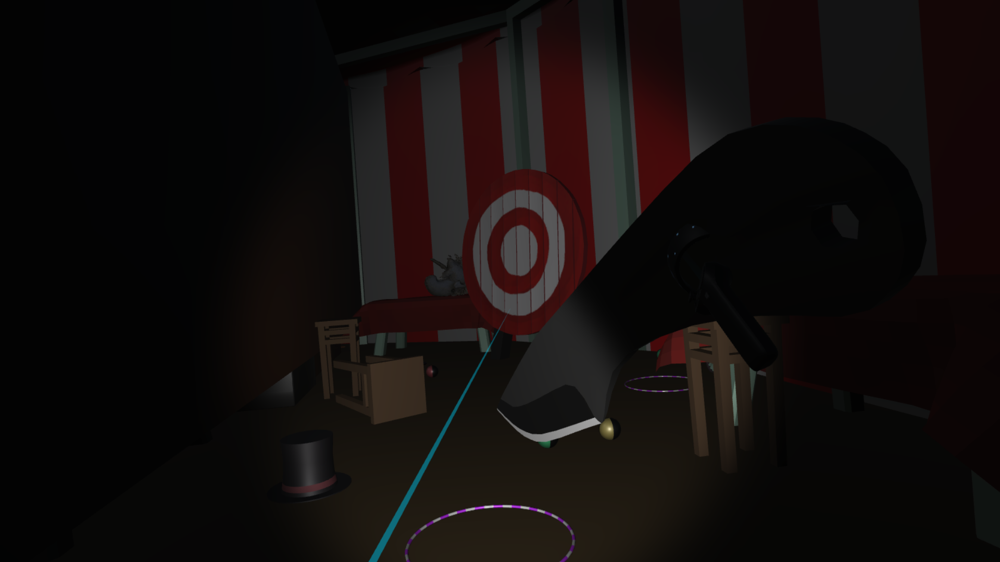
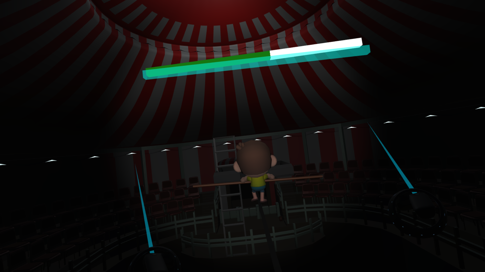
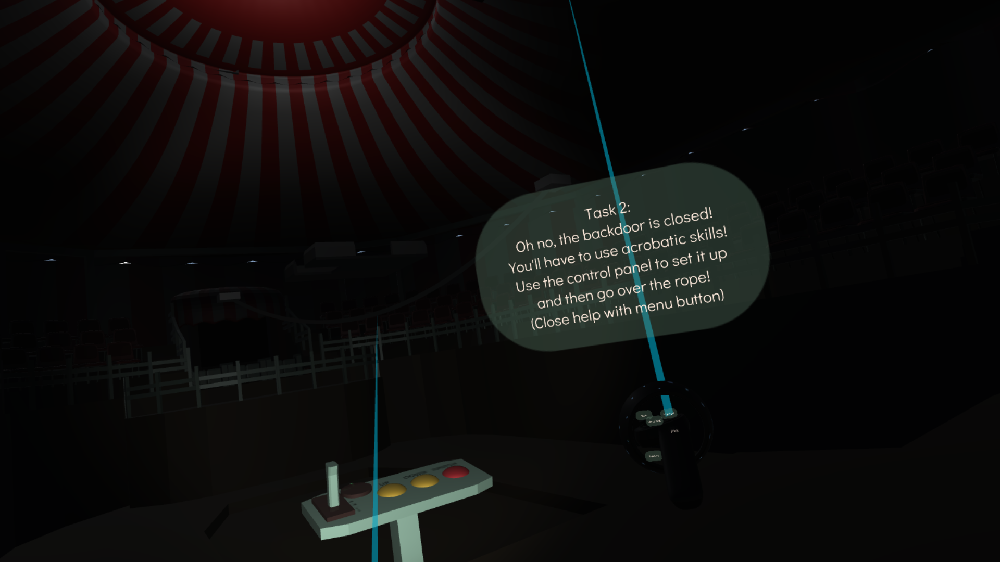
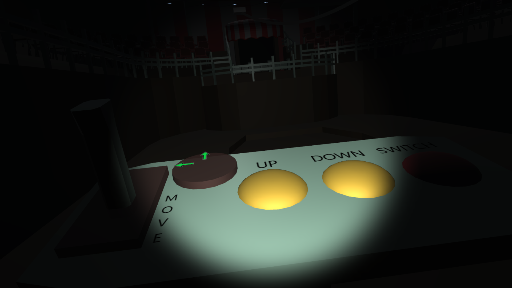
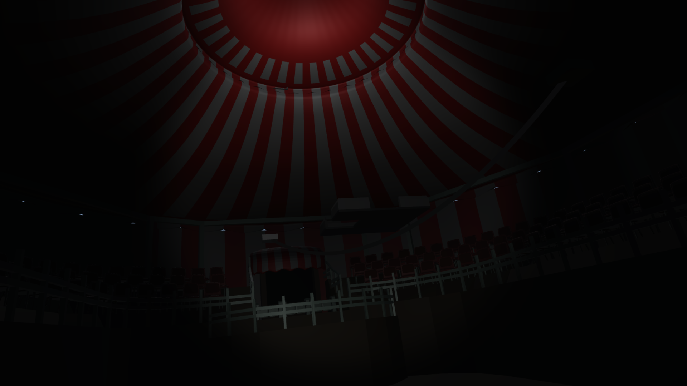

# Midnight at the Circus

A VR escape game developed in Unity in collaboration with Bc. Tereza Hlavová.

## Overview

You find yourself trapped in a circus after closing hours. The careless staff has left you alone with a hungry lion, a messy backstage, and locked doors. Your mission is to escape by solving puzzles and navigating through the circus using your wits and the environment around you.

## Gameplay

### Task 1: Lion
You have found yourself left alone in a circus after closing hours. The staff was very careless and left a hungry lion out of its cage, a mess in the backstage and you in the middle of it all. The lion likes his meal chopped and usually goes to sleep after eating to the tunes of classical music.

### Task 2: Acrobatics
Now that the lion is finally sleeping peacefully in its cage, you can peek behind the curtain. The staff was very careless, they locked the back door! The circus is constructed so that the performers can meet the audience only near the entrance, so you will need to get there the "performance way". Use the control panel to correctly set up the acrobatics construction and then go over the rope to the entrance area!

### Task 3: Turnstiles
You are near the entrance, yaay! But wait, the turnstiles appear to be closed and stuck. You will need to find a ticket to get through!

## Media

### Video Demo

### Screenshots

#### Task 1: Lion

#### Task 2: Acrobatics

#### Additional Screenshots

## Documentation

## Development

- **Engine**: Unity
- **Platform**: VR
- **Genre**: Escape Room / Puzzle
- **Collaboration**: Bc. Tereza Hlavová
